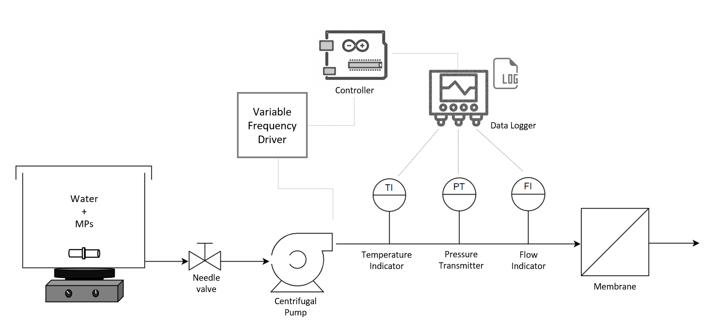
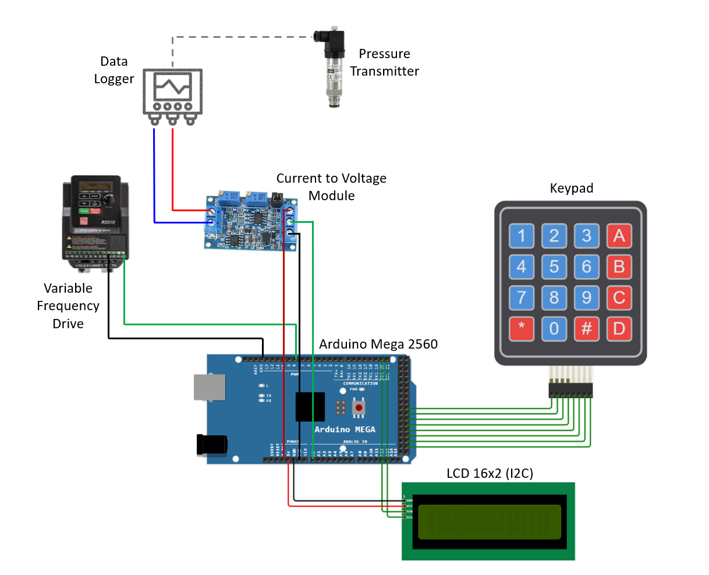

# PumpConstantPressure

This repository contains the code to work at constant pressure in a filtration system where the pump is regulated through a variable-frequency drive (VFD). 

The Arduino Mega 2560 board gains the information “Pressure Target” directly from the user through the keypad, and it displays it on the LCD screen together with the instant pressure value, which is taken from the data logger by converting the current value into an analog voltage input. 

Arduino measures the difference between the instant pressure and the “Pressure Target” to act on the variable frequency drive and increase or decrease the pump outlet.

